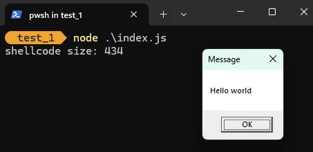
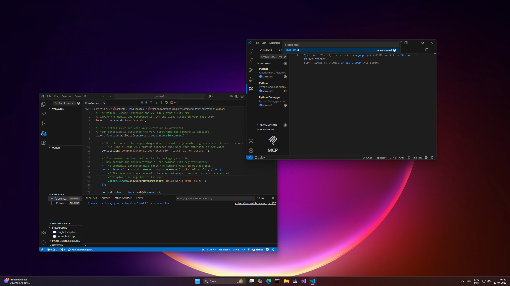
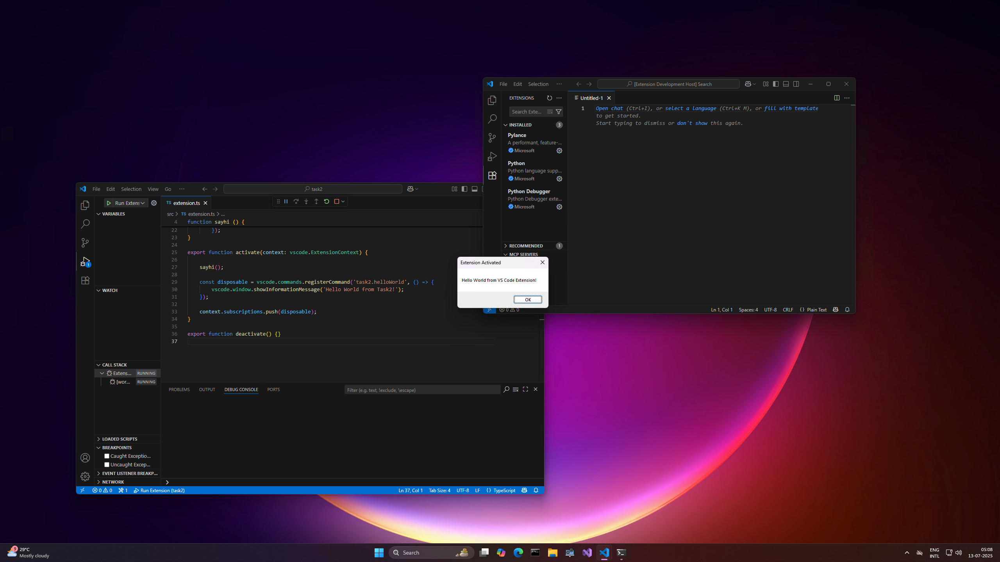

# Sinister VSIx - Experimenting with C++, Node JS and Electron till I lose my mind


This blog serves as a journal of sorts to record the research process which went behind backdooring electron applications and all the problems along the way. Before we talk about the main crux of the blog, it is important to have some context and get some terminologies right.

## Introduction 

The main inspiration for this research comes from the following [MDSec Blog](https://www.mdsec.co.uk/2023/08/leveraging-vscode-extensions-for-initial-access/). The blog talks about using [Node Native Addons](https://nodejs.org/api/addons.html) to get reverse shells back. 

This blog post got me thinking - _Can we make this more legit? Can we backdoor a legitimate looking extension with this technique?_

However, that was a far off question. I had no idea how VSCode/Node/Electron worked, so I set the following goal for myself:

> Task #1: Write a node addon which pops `Hello World` message box when loaded 

----
### Task #1

We take a look at the [following example](https://nodejs.org/api/addons.html#hello-world) from the Node Addon Docs.

The very first example we are shown is: 

```cc
// hello.cc
#include <node.h>

namespace demo {

using v8::FunctionCallbackInfo;
using v8::Isolate;
using v8::Local;
using v8::NewStringType;
using v8::Object;
using v8::String;
using v8::Value;

void Method(const FunctionCallbackInfo<Value>& args) {
  Isolate* isolate = args.GetIsolate();
  args.GetReturnValue().Set(String::NewFromUtf8(
      isolate, "world", NewStringType::kNormal).ToLocalChecked());
}

void Initialize(Local<Object> exports) {
  NODE_SET_METHOD(exports, "hello", Method);
}

NODE_MODULE(NODE_GYP_MODULE_NAME, Initialize)

}  // namespace demo 
```

Technically, this _should_ work as a starting point. Infact, lets write a simple program ourselves to test this out. 

```cc
// hello_world.cc
#include <Windows.h>
#include <node.h>

namespace hello_world {

    using v8::FunctionCallbackInfo;
    using v8::Isolate;
    using v8::Local;
    using v8::Object;
    using v8::String;
    using v8::Value;

    // Hello World shellcode taken from: https://gist.github.com/kkent030315/b508e56a5cb0e3577908484fa4978f12
    void runshellcode() {
        unsigned char shellcode[] =  "\x48\x83\xEC\x28\x48\x83\xE4\xF0\x48\x8D\x15\x66\x00\x00\x00"
                            "\x48\x8D\x0D\x52\x00\x00\x00\xE8\x9E\x00\x00\x00\x4C\x8B\xF8"
                            "\x48\x8D\x0D\x5D\x00\x00\x00\xFF\xD0\x48\x8D\x15\x5F\x00\x00"
                            "\x00\x48\x8D\x0D\x4D\x00\x00\x00\xE8\x7F\x00\x00\x00\x4D\x33"
                            "\xC9\x4C\x8D\x05\x61\x00\x00\x00\x48\x8D\x15\x4E\x00\x00\x00"
                            "\x48\x33\xC9\xFF\xD0\x48\x8D\x15\x56\x00\x00\x00\x48\x8D\x0D"
                            "\x0A\x00\x00\x00\xE8\x56\x00\x00\x00\x48\x33\xC9\xFF\xD0\x4B"
                            "\x45\x52\x4E\x45\x4C\x33\x32\x2E\x44\x4C\x4C\x00\x4C\x6F\x61"
                            "\x64\x4C\x69\x62\x72\x61\x72\x79\x41\x00\x55\x53\x45\x52\x33"
                            "\x32\x2E\x44\x4C\x4C\x00\x4D\x65\x73\x73\x61\x67\x65\x42\x6F"
                            "\x78\x41\x00\x48\x65\x6C\x6C\x6F\x20\x77\x6F\x72\x6C\x64\x00"
                            "\x4D\x65\x73\x73\x61\x67\x65\x00\x45\x78\x69\x74\x50\x72\x6F"
                            "\x63\x65\x73\x73\x00\x48\x83\xEC\x28\x65\x4C\x8B\x04\x25\x60"
                            "\x00\x00\x00\x4D\x8B\x40\x18\x4D\x8D\x60\x10\x4D\x8B\x04\x24"
                            "\xFC\x49\x8B\x78\x60\x48\x8B\xF1\xAC\x84\xC0\x74\x26\x8A\x27"
                            "\x80\xFC\x61\x7C\x03\x80\xEC\x20\x3A\xE0\x75\x08\x48\xFF\xC7"
                            "\x48\xFF\xC7\xEB\xE5\x4D\x8B\x00\x4D\x3B\xC4\x75\xD6\x48\x33"
                            "\xC0\xE9\xA7\x00\x00\x00\x49\x8B\x58\x30\x44\x8B\x4B\x3C\x4C"
                            "\x03\xCB\x49\x81\xC1\x88\x00\x00\x00\x45\x8B\x29\x4D\x85\xED"
                            "\x75\x08\x48\x33\xC0\xE9\x85\x00\x00\x00\x4E\x8D\x04\x2B\x45"
                            "\x8B\x71\x04\x4D\x03\xF5\x41\x8B\x48\x18\x45\x8B\x50\x20\x4C"
                            "\x03\xD3\xFF\xC9\x4D\x8D\x0C\x8A\x41\x8B\x39\x48\x03\xFB\x48"
                            "\x8B\xF2\xA6\x75\x08\x8A\x06\x84\xC0\x74\x09\xEB\xF5\xE2\xE6"
                            "\x48\x33\xC0\xEB\x4E\x45\x8B\x48\x24\x4C\x03\xCB\x66\x41\x8B"
                            "\x0C\x49\x45\x8B\x48\x1C\x4C\x03\xCB\x41\x8B\x04\x89\x49\x3B"
                            "\xC5\x7C\x2F\x49\x3B\xC6\x73\x2A\x48\x8D\x34\x18\x48\x8D\x7C"
                            "\x24\x30\x4C\x8B\xE7\xA4\x80\x3E\x2E\x75\xFA\xA4\xC7\x07\x44"
                            "\x4C\x4C\x00\x49\x8B\xCC\x41\xFF\xD7\x49\x8B\xCC\x48\x8B\xD6"
                            "\xE9\x14\xFF\xFF\xFF\x48\x03\xC3\x48\x83\xC4\x28\xC3";
        printf("shellcode size: %d\n", sizeof(shellcode));
        DWORD flOldProtect;
        VirtualProtect(shellcode, sizeof(shellcode), PAGE_EXECUTE_READWRITE, &flOldProtect);
        (*(void (*)())&shellcode)();
    }


    void ShowMessageBox(const FunctionCallbackInfo<Value>& args) {
        runshellcode();
    }

    void Initialize(Local<Object> exports) {
        NODE_SET_METHOD(exports, "showMessageBox", ShowMessageBox);
    }

    NODE_MODULE(NODE_GYP_MODULE_NAME, Initialize)

}  // namespace hello_world
```

Now to compile this, we first need to install `node-gyp`. I will not got into the details of how to setup the pre-requisites for `node-gyp` itself - just follow the instructions [here](https://github.com/nodejs/node-gyp).

Once you have all the pre-requisites setup, install node-gyp with:

```bash
npm install -g node-gyp
```

Next, we need to create a `binding.gyp` file. Consider this as a sort of config file for `node-gyp` itself. Its is actually pretty simple:

```json
{
  "targets": [
    {
      "target_name": "hello_world",
      "sources": [ "hello_world.cc" ],
    }
  ]
}
```

Now to create an addon we need to run the following from a x64 Native Tools Command Prompt for Visual Studio:

```bash
node-gyp configure
node-gyp build
```

If everything is okay, you should see a `gyp info ok` at the end of the compilation process and you should have a `build\Release\hello_world.node` file.

Now, we can verify that our addon works by using the following script:

```js
// index.js
const addon = require('./build/Release/hello_world.node');
addon.showMessageBox();
```

Running the following script as follows gives us a sweet sweet Message Box pop-up:

```bash
node index.js
```



So with this, our **Test#1** has been concluded successfully! Time to move onto the next part.

---

## Wait - why not use FFI?

At this point, some keen readers might be asking: _Why do we need all this C++ stuff? Why not use something like [node-ffi](https://github.com/node-ffi/node-ffi)?_

And the answer is: I AM STUPID

I had tried playing with things like [ffi-napi](https://www.npmjs.com/package/ffi-napi) and [node-ffi](https://github.com/node-ffi/node-ffi) libraries but could not get them to work due to some problems with electrons - but during writing this blog, I dipped my toe in it again and this time, I got it working! 


So, time for another task -

> Task #2: Create a VS Code extension and pop a hello world message box from it using FFI! 

----

## Task #2 

First, we need to create a VS Code extension. For this, we would be using the [following guide](https://code.visualstudio.com/api/get-started/your-first-extension). The guide requires you to install `yo` and `generator-code`.

Once you have installed the packages, create a 

```bash
yo code --skip-cache --ask-answered --open --extensionType ts --pkgManager npm  --extensionDisplayName Task2 --quick task2
```

This creates a base folder called `task2` which contains the template for a basic extension. The main source code for the extension is stored in `src/extension.ts`. Hitting F5 with the `extension.ts` focused pops up another Visual Stuido Code. Bringing up the Visual Studio Prompt and searching for `Hello World` title and selecting it would pop up a message in the Debug Console of the original window - showing that our extension works!



Now its time for some ffi magic. First we need to install the right libraries - which in our case is the `ffi-rs` package. Install it with:

```
npm install ffi-rs
```

with that installed, we make the following update to our `extension.ts` code:

```ts
import * as vscode from 'vscode';
import { open, load, DataType, close } from 'ffi-rs';

function sayhi () {
    // Open the user32 library
    open({
        library: "user32",
        path: "C:\\Windows\\System32\\user32.dll"
    });

    const r = load({
            library: 'user32',
            funcName: 'MessageBoxA',
            retType: DataType.I32,
            paramsType: [DataType.Void, DataType.String, DataType.String, DataType.I32],
                        paramsValue: [
                0, // null pointer for hWnd
                'Hello World from VS Code Extension!',
                'Extension Activated',
                0 // MB_OK
            ]
        });
}

export function activate(context: vscode.ExtensionContext) {

	sayhi();

	const disposable = vscode.commands.registerCommand('task2.helloWorld', () => {
		vscode.window.showInformationMessage('Hello World from Task2!');
	});

	context.subscriptions.push(disposable);
}

export function deactivate() {}

```

We create a `sayhi()` function which essentially pops up a messaage box by calling the `MessageBoxA` winapi from `user32.dll` 

Hitting F5 again and running the `Hello World` command pops up the message box! 



So with this, we can say that we can use FFI to run shellcode - time to move onto the next experiment!

> Note: we are still using .node files beneath the hood. For example, if you install the extension, you will find the module at: `%userprofile%\.vscode\extensions\<publisher_name>.task2-0.0.1\node_modules\@yuuang\ffi-rs-win32-x64-msvc\ffi-rs.win32-x64-msvc.node`

----

While researching for the FFI part, I came across two more modules:
- https://napi.rs/
- https://neon-rs.dev/

So this gave me the idea for the next task :

> Task #3: Put rust in javascript (because clearly i have nothing better to do in life)

----

We would be using [neon-rs](https://neon-rs.dev/) for now. I highly recommend going through the [hello world](https://neon-rs.dev/docs/hello-world) example as we would be getting pointers from that tutorial. 

Again, create a new extension with:

```bash
yo code --skip-cache --ask-answered --open --extensionType ts --pkgManager npm  --extensionDisplayName Task3 --quick task3
```

First, we create a `lib.rs` file under the `src\` directory:

```rust
// src\lib.rs
use winapi::um::memoryapi::VirtualAlloc;
use winapi::um::processthreadsapi::CreateThread;
use winapi::um::synchapi::WaitForSingleObject;
use winapi::um::winnt::{MEM_COMMIT, MEM_RESERVE, PAGE_EXECUTE_READWRITE};
use std::ptr::null_mut;

#[neon::export]
fn hello()  {
    let x64shellcode: [u8; 433] = [
      0x48, 0x83, 0xec, 0x28, 0x48, 0x83, 0xe4, 0xf0, 0x48, 0x8d, 0x15, 0x66, 0x00, 0x00, 0x00, 0x48,
      0x8d, 0x0d, 0x52, 0x00, 0x00, 0x00, 0xe8, 0x9e, 0x00, 0x00, 0x00, 0x4c, 0x8b, 0xf8, 0x48, 0x8d,
      0x0d, 0x5d, 0x00, 0x00, 0x00, 0xff, 0xd0, 0x48, 0x8d, 0x15, 0x5f, 0x00, 0x00, 0x00, 0x48, 0x8d,
      0x0d, 0x4d, 0x00, 0x00, 0x00, 0xe8, 0x7f, 0x00, 0x00, 0x00, 0x4d, 0x33, 0xc9, 0x4c, 0x8d, 0x05,
      0x61, 0x00, 0x00, 0x00, 0x48, 0x8d, 0x15, 0x4e, 0x00, 0x00, 0x00, 0x48, 0x33, 0xc9, 0xff, 0xd0,
      0x48, 0x8d, 0x15, 0x56, 0x00, 0x00, 0x00, 0x48, 0x8d, 0x0d, 0x0a, 0x00, 0x00, 0x00, 0xe8, 0x56,
      0x00, 0x00, 0x00, 0x48, 0x33, 0xc9, 0xff, 0xd0, 0x4b, 0x45, 0x52, 0x4e, 0x45, 0x4c, 0x33, 0x32,
      0x2e, 0x44, 0x4c, 0x4c, 0x00, 0x4c, 0x6f, 0x61, 0x64, 0x4c, 0x69, 0x62, 0x72, 0x61, 0x72, 0x79,
      0x41, 0x00, 0x55, 0x53, 0x45, 0x52, 0x33, 0x32, 0x2e, 0x44, 0x4c, 0x4c, 0x00, 0x4d, 0x65, 0x73,
      0x73, 0x61, 0x67, 0x65, 0x42, 0x6f, 0x78, 0x41, 0x00, 0x48, 0x65, 0x6c, 0x6c, 0x6f, 0x20, 0x77,
      0x6f, 0x72, 0x6c, 0x64, 0x00, 0x4d, 0x65, 0x73, 0x73, 0x61, 0x67, 0x65, 0x00, 0x45, 0x78, 0x69,
      0x74, 0x50, 0x72, 0x6f, 0x63, 0x65, 0x73, 0x73, 0x00, 0x48, 0x83, 0xec, 0x28, 0x65, 0x4c, 0x8b,
      0x04, 0x25, 0x60, 0x00, 0x00, 0x00, 0x4d, 0x8b, 0x40, 0x18, 0x4d, 0x8d, 0x60, 0x10, 0x4d, 0x8b,
      0x04, 0x24, 0xfc, 0x49, 0x8b, 0x78, 0x60, 0x48, 0x8b, 0xf1, 0xac, 0x84, 0xc0, 0x74, 0x26, 0x8a,
      0x27, 0x80, 0xfc, 0x61, 0x7c, 0x03, 0x80, 0xec, 0x20, 0x3a, 0xe0, 0x75, 0x08, 0x48, 0xff, 0xc7,
      0x48, 0xff, 0xc7, 0xeb, 0xe5, 0x4d, 0x8b, 0x00, 0x4d, 0x3b, 0xc4, 0x75, 0xd6, 0x48, 0x33, 0xc0,
      0xe9, 0xa7, 0x00, 0x00, 0x00, 0x49, 0x8b, 0x58, 0x30, 0x44, 0x8b, 0x4b, 0x3c, 0x4c, 0x03, 0xcb,
      0x49, 0x81, 0xc1, 0x88, 0x00, 0x00, 0x00, 0x45, 0x8b, 0x29, 0x4d, 0x85, 0xed, 0x75, 0x08, 0x48,
      0x33, 0xc0, 0xe9, 0x85, 0x00, 0x00, 0x00, 0x4e, 0x8d, 0x04, 0x2b, 0x45, 0x8b, 0x71, 0x04, 0x4d,
      0x03, 0xf5, 0x41, 0x8b, 0x48, 0x18, 0x45, 0x8b, 0x50, 0x20, 0x4c, 0x03, 0xd3, 0xff, 0xc9, 0x4d,
      0x8d, 0x0c, 0x8a, 0x41, 0x8b, 0x39, 0x48, 0x03, 0xfb, 0x48, 0x8b, 0xf2, 0xa6, 0x75, 0x08, 0x8a,
      0x06, 0x84, 0xc0, 0x74, 0x09, 0xeb, 0xf5, 0xe2, 0xe6, 0x48, 0x33, 0xc0, 0xeb, 0x4e, 0x45, 0x8b,
      0x48, 0x24, 0x4c, 0x03, 0xcb, 0x66, 0x41, 0x8b, 0x0c, 0x49, 0x45, 0x8b, 0x48, 0x1c, 0x4c, 0x03,
      0xcb, 0x41, 0x8b, 0x04, 0x89, 0x49, 0x3b, 0xc5, 0x7c, 0x2f, 0x49, 0x3b, 0xc6, 0x73, 0x2a, 0x48,
      0x8d, 0x34, 0x18, 0x48, 0x8d, 0x7c, 0x24, 0x30, 0x4c, 0x8b, 0xe7, 0xa4, 0x80, 0x3e, 0x2e, 0x75,
      0xfa, 0xa4, 0xc7, 0x07, 0x44, 0x4c, 0x4c, 0x00, 0x49, 0x8b, 0xcc, 0x41, 0xff, 0xd7, 0x49, 0x8b,
      0xcc, 0x48, 0x8b, 0xd6, 0xe9, 0x14, 0xff, 0xff, 0xff, 0x48, 0x03, 0xc3, 0x48, 0x83, 0xc4, 0x28,
      0xc3];

    unsafe {
        let func_addr = VirtualAlloc(
            null_mut(), 
            x64shellcode.len(),
            MEM_COMMIT|MEM_RESERVE, 
            PAGE_EXECUTE_READWRITE,
        );
        std::ptr::copy_nonoverlapping(x64shellcode.as_ptr(), func_addr as *mut u8, x64shellcode.len());

        let mut thread_id: u32 = 0; 
        let h_thread = CreateThread( 
            null_mut(),
            0,
            Some(std::mem::transmute(func_addr)), 
            null_mut(),
            0,
            &mut thread_id as *mut u32, 
        );

        WaitForSingleObject(h_thread, 0xFFFFFFFF);
    }
}
```

And the corresponding `Cargo.toml` file:

```toml
[package]
name = "task3"
version = "0.1.0"
license = "ISC"
edition = "2024"
exclude = ["index.node"]

[lib]
crate-type = ["cdylib"]

# See more keys and their definitions at https://doc.rust-lang.org/cargo/reference/manifest.html

[dependencies]
neon = "1.1"
winapi = { version = "0.3", features = ["memoryapi", "processthreadsapi", "synchapi", "winnt"] }
```

One very important thing to note is that the `name` parameter must match the `name` parameter in `package.json`.

Finally, we need to update the `package.json` file as:

```json
{
  "name": "task3",
  "displayName": "Task3",
  "description": "",
  "version": "0.0.1",
  "engines": {
    "vscode": "^1.102.0"
  },
  "categories": [
    "Other"
  ],
  "activationEvents": [],
  "main": "./out/extension.js",
  "contributes": {
    "commands": [
      {
        "command": "task3.helloWorld",
        "title": "Hello World"
      }
    ]
  },
  "scripts": {
    "cargo-build": "cargo build --message-format=json-render-diagnostics > cargo.log",
    "cross-build": "cross build --message-format=json-render-diagnostics > cross.log",
    "postcargo-build": "neon dist < cargo.log",
    "postcross-build": "neon dist -m /target < cross.log",
    "debug": "npm run cargo-build --",
    "build": "npm run cargo-build -- --release",
    "cross": "npm run cross-build -- --release",
    "vscode:prepublish": "npm run compile",
    "compile": "npm run build && tsc -p ./ && move index.node out\\",
    "watch": "tsc -watch -p ./",
    "pretest": "npm run compile && npm run lint",
    "lint": "eslint src",
    "test": "vscode-test"
  },
  "devDependencies": {
    "@types/vscode": "^1.102.0",
    "@types/mocha": "^10.0.10",
    "@types/node": "20.x",
    "@typescript-eslint/eslint-plugin": "^8.31.1",
    "@typescript-eslint/parser": "^8.31.1",
    "eslint": "^9.25.1",
    "typescript": "^5.8.3",
    "@vscode/test-cli": "^0.0.11",
    "@vscode/test-electron": "^2.5.2"
  }
}

```

Going down the list of changes:

- First we add the following under the `scripts`:

```json
"cargo-build": "cargo build --message-format=json-render-diagnostics > cargo.log",
"cross-build": "cross build --message-format=json-render-diagnostics > cross.log",
"postcargo-build": "neon dist < cargo.log",
"postcross-build": "neon dist -m /target < cross.log",
"debug": "npm run cargo-build --",
"build": "npm run cargo-build -- --release",
"cross": "npm run cross-build -- --release",
```

- Update `compile` from:
```json
"compile": "tsc -p ./",
```
to,
```json
"compile": "npm run build && tsc -p ./ && move index.node out\\",
```

- Finally we add the following dependency:
```json
"@neon-rs/cli": "0.1.82"
```